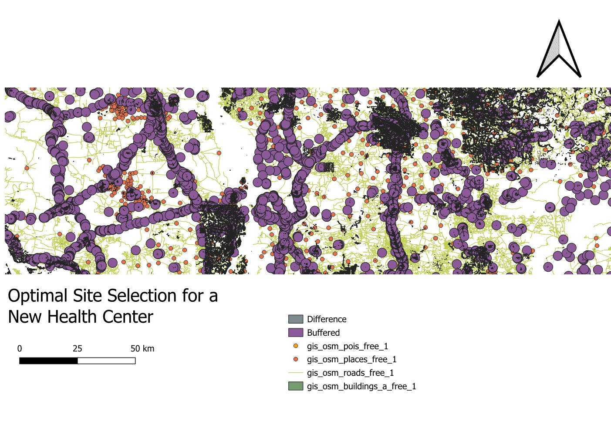
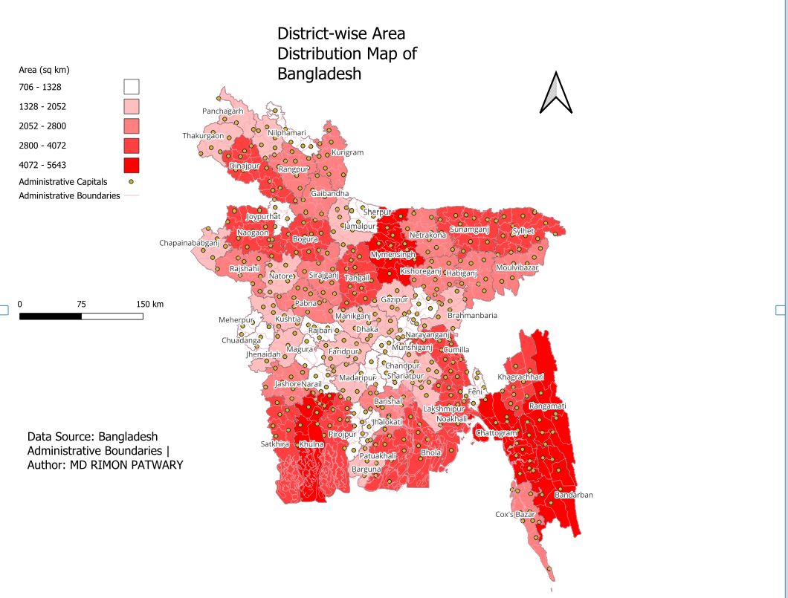

# 🏥 Optimal Site Selection for a New Health Center using QGIS

> **Author:** MD RIMON PATWARY | GIS & Spatial Analyst

### ## Overview
This project uses spatial analysis and multi-criteria site suitability modeling in QGIS to identify the most suitable location for a new health center.

### ## Objectives
- Analyze spatial factors influencing health facility accessibility
- Develop a suitability model using relevant criteria
- Recommend optimal sites based on the analysis

### 🗺️ Final Output Maps

#### 1. Health Center Site Selection Map
Suitability analysis using buffer & overlay on road network and existing facilities.

#### 2. District-wise Area Distribution Map of Bangladesh
Choropleth map showing area distribution across 64 districts.

### ## Tools & Technologies
- QGIS
- Spatial Analysis
- Multi-criteria Decision Analysis (MCDA)
- Cartography

### ## Methodology
1. Data collection (population density, road network, existing health facilities, land use, etc.)
2. Data preprocessing and projection
3. Criteria weighting and suitability modeling
4. Final site recommendation and mapping

### ## Key Skills Demonstrated
`QGIS` `Spatial Analysis` `Site Suitability Modeling` `Cartography` `GIS`

### ## Project Status
Completed (Portfolio Project)

### ## Connect
[LinkedIn](https://www.linkedin.com/in/md-rimon-patwary)

---
Data Source: Bangladesh Administrative Boundaries | OpenStreetMap (OSM)
